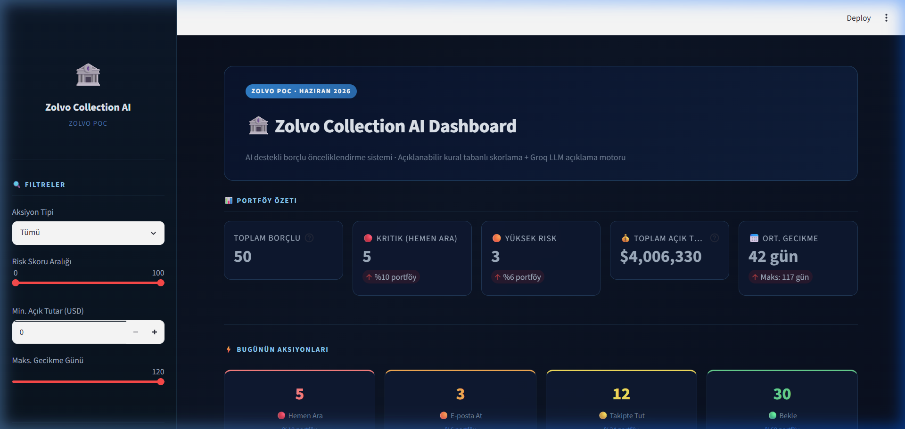
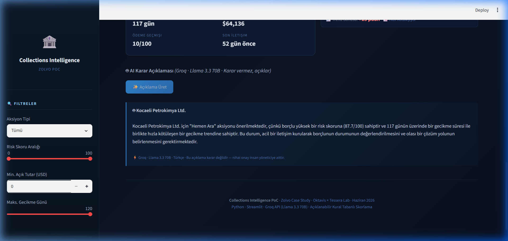

# 🏦 Zolvo Collection AI

Zolvo Collection AI, şirketlerin (B2B) gecikmiş alacaklarını (tahsilat) yönetmelerini kolaylaştıran, yapay zeka destekli bir **Borçlu Önceliklendirme ve Karar Destek** sistemidir. 

Bu PoC (Proof of Concept) uygulaması, kural tabanlı algoritmalar ile hesaplanan risk skorlarını, **Llama 3.3 70B** dil modelinin üstün muhakeme yeteneği ile birleştirerek tahsilat ekiplerine "açıklanabilir" ve şeffaf aksiyon önerileri sunar.



## 🌟 Temel Özellikler

* **📊 Kural Tabanlı Risk Skorlama:** Gecikme günü, açık tutar, ödeme geçmişi, son iletişim tarihi ve gecikme trendi metriklerini kullanarak her borçlu için 0-100 arası matematiksel bir risk skoru hesaplar.
* **🤖 LLM Destekli Açıklanabilirlik:** Sadece "Hemen Ara" veya "E-posta At" demekle kalmaz; arka planda Groq API üzerinden çalışan **Llama 3.3 70B** modeli ile bu aksiyonun *neden* önerildiğini, insan dilinde (Türkçe/İngilizce) detaylıca açıklar. *Not: Yapay zeka doğrudan karar almaz, alınan kural tabanlı kararı açıklar.*
* **🛡️ Bulut Tabanlı Güvenlik (Cloudflare Workers):** Sistem, API anahtarlarını güvende tutmak için istemci tarafında anahtar barındırmaz. İstekler, Cloudflare üzerinde çalışan bir Serverless Proxy üzerinden şifreli bir şekilde API'ye iletilir.
* **⚡ Yüksek Performanslı Arayüz:** Streamlit ile geliştirilen anlık filtreleme, metrik kartları ve durum panelleri sayesinde portföyü saniyeler içinde analiz etmenizi sağlar.



## 🧠 Çalışma Mantığı (Mimari)

1. **Sentetik Veri Üretimi (`data_generator.py`):** Rastgele B2B borçlu verileri (isim, gecikme günü, tutar, geçmiş skorlar) üretilir.
2. **Skorlama Motoru (`scoring_engine.py`):** Üretilen veriler dinamik bir formül süzgecinden geçer:
   * %35 Gecikme Günü
   * %25 Açık Tutar
   * %20 Ödeme Geçmişi
   * %20 Son İletişim Tarihi
   * ± Gecikme Trendi Bonusu
3. **Streamlit UI (`app.py`):** Skorlanan veriler görselleştirilir, filtrelenir ve kullanıcıya sunulur.
4. **Cloudflare Proxy:** "Açıklama Üret" butonuna basıldığında, Streamlit doğrudan Groq API'sine gitmez. Önce Cloudflare Worker'a istek atar. Cloudflare, arka planda güvenli şifreyi ekleyerek isteği Groq'a iletir.
5. **LLM Motoru (`llm_engine.py`):** Llama 3.3 70B modeli, gelen veriyi analiz ederek temsilci için bir konuşma / strateji açıklaması hazırlar.

## 🚀 Kurulum ve Çalıştırma

Projeyi yerel bilgisayarınızda çalıştırmak için aşağıdaki adımları izleyin:

### Gereksinimler
- Python 3.10 veya üzeri
- Cloudflare Hesabı (Proxy güvenlik katmanı için)

### Adımlar

1. **Depoyu Klonlayın**
   ```bash
   git clone https://github.com/emreerbasli/Case.git
   cd Case
   ```

2. **Gerekli Kütüphaneleri Yükleyin**
   ```bash
   pip install -r requirements.txt
   ```

3. **Güvenlik Proxy'sini Ayarlayın**
   * Uygulamanın içerisinde API Key bulunmamaktadır.
   * Kendi Cloudflare Worker'ınızı oluşturup `ZOLVO_API_KEY` environment variable'ı ile Groq API anahtarınızı tanımlayın.
   * `llm_engine.py` içerisindeki `base_url` kısmına kendi Worker adresinizi yapıştırın.

4. **Uygulamayı Başlatın**
   ```bash
   streamlit run app.py
   ```

## 🛠️ Kullanılan Teknolojiler

* **Backend / Frontend:** Python, Streamlit, Pandas
* **Yapay Zeka (LLM):** Meta Llama 3.3 70B (Groq API üzerinden)
* **Güvenlik Katmanı:** Cloudflare Workers (Serverless Edge Proxy)
* **Versiyon Kontrolü:** Git & GitHub

---
*Bu proje, Collections Intelligence sistemlerinin potansiyelini göstermek amacıyla oluşturulmuş bir Proof of Concept (PoC) çalışmasıdır.*
